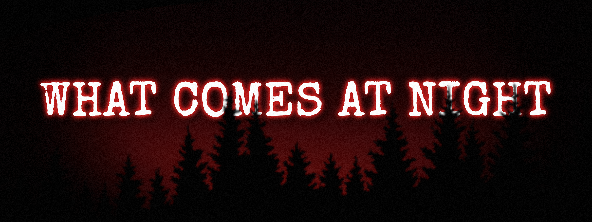

# 🌙 What Comes At Night

<p align="center">
  
</p>
<p align="center">
  <i>Minimalist Survival Horror. 50 Turns. One Goal: Survive until Dawn.</i>
</p>
<p align="center">
  <a href="https://what-comes-at-night.vercel.app/"><strong>Play <i>What Comes At Night</i> on Browser</strong></a>
</p>

**What Comes At Night** is a minimalist, text-based survival horror game. Stranded in a remote campsite, you must endure a single, harrowing night against escalating supernatural threats. Master turn-based strategy and resource management to survive 50 turns against the supernatural until dawn.

---

## 🎮 Game Overview

### Gameplay
* **The Setup:** The sun has set. You're alone at the campsite with limited time to prepare.
* **Three Vital Stats:** Manage **Health**, **Stamina**, and **Noise** to survive.
* **Scavenge & Fortify:** Search woods and structures for weapons, food, and materials. Build fortifications against attacks.
* **The Noise System:** Every action generates noise. High noise attracts lone monsters. Rest or hide to reduce detection.
* **Timed Hordes:** At key phases, waves of Zombies, Skeletons, and boss monsters attack. Your preparation will be tested.
* **7 Phases, 50 Actions:** Progress from Dusk through The Witching Hour to Dawn. Each phase increases difficulty.

### How To Play
1. **Game Interface**
    - **Stats Bar (Top):** Monitor Health, Stamina, Fortification, and Noise here. You can find the current phase, the actions left in the current phase, your location, and the number of monsters here.
    - **Story Log (Middle):** This is the main story text. It updates every turn and tells you about what has happened, what you have found, and what is about to take your life. Read it carefully.
    - **Action Menu (Bottom):** These are your controls.
        - **Category (Left):** Select your category, e.g. **MOVE**, **ATTACK**, etc. Each category has different actions.
        - **Actions (Right):** Select a specific action here. Clicking an action immediately triggers it.
        - **Tooltip (ⓘ):** If you are ever confused, click the tooltip button on the far right of a specific action to figure out what it costs and what effects it has.
    - **Footer:** Contains additional options
        - **Show Inventory:** Look at the items you have remaining in your inventory.
        - **Options:** Control the volume and enable/disable the text highlighting.
        - **Main Menu:** Return to the main menu.
2. **Survival Mechanics**
    - **Stamina:** Almost every action costs stamina. Rest to recover. If you run out, you cannot work or fight.
    - **Health:** Monsters can and will attack you. If this hits zero, you die. Heal using Bandages or Food.
    - **Noise:** Scavenging and building make noise. High noise attracts lone monsters. Hide to reduce noise.
    - **Fortification HP:** Build walls to protect yourself. A strong gate can save you when the Horde attacks.
3. **Gameplay**
    - Select a category and an action. Each action advances the clock.
    - After you act, the game updates. Monsters may spawn, move closer, or attack your fortifications depending on the Noise you made.
    - Read the text log carefully. It tells you what you found, if your defenses held, if you took damage, or if new threats have emerged.
4. **The Monsters**
    - **Lone Monsters:** Attracted by noise. You can kill them or hide from them.
    - **The Horde:** Appears in each phase from Nightfall onwards. You cannot hide. You must fight or tank the damage.
    - **Bosses:** Stronger enemies with special abilities. Kill them quickly before they overwhelm you.
5. **Phases**
    - The game is composed of 50 moves spread across 7 phases.
        - Dusk and Evening are the exploration phases. Use this time to scavenge for resources and fortify your defenses. Be careful, if you create too much noise, lone monsters might wander towards you.
        - Nightfall and Deep Night are the phases when darkness takes over. Small hordes will begin to spawn. You cannot hide from them!
        - The Witching Hour is the peak of the night. A massive horde, led by a boss monster will attack. Your preparations will be tested.
        - Pre-Dawn is the final stretch as the sun begins to rise. Survive for a few more moves until Dawn to win.

---

## 🛠️ Technical Highlights

### Key Features

* **Fully Data-Driven:** The entire game balance: monsters, items, loot tables, text, and settings, all are defined in external JSON files, making it easy to rebalance.
* **Reactive UI:** Built with **Vue 3** and **Pinia** for instant, reactive state management.
* **Immersive Audio:** Features a dynamic audio system using **Howler.js** that crossfades music tracks based on the game phase.
* **Mobile-Responsive Design:** A responsive, "app-like" layout that works perfectly on desktop and mobile devices.
* **State Persistence:** The game automatically saves progress to `localStorage` after every move.
* **Phase-Based Theming:** CSS variables dynamically shift accent colors (orange → purple → blue → red) as night progresses

### Tech Stack

| Category | Technology |
|----------|-----------|
| **Framework** | [Vue 3](https://vuejs.org/) |
| **State Management** | [Pinia](https://pinia.vuejs.org/) |
| **Build Tool** | [Vite](https://vitejs.dev/) |
| **Audio** | [Howler.js](https://howlerjs.com/) |
| **Styling** | Custom CSS with Grid layout + CSS Variables |
| **Fonts** | Google Fonts (Special Elite, Roboto Condensed) |

### Getting Started

This project requires **Node.js** (v22.x or higher recommended).

1.  **Clone the repository:**
    ```sh
    git clone https://github.com/frozen4917/what-comes-at-night.git
    cd what-comes-at-night
    ```

2.  **Install dependencies:**
    ```sh
    npm install
    ```

3.  **Run the development server:**
    ```sh
    npm run dev
    ```

4.  **Build for production:**
    ```sh
    npm run build
    ```
    The build artifacts will be stored in the `dist/` directory.

### Project Architecture

The codebase follows a strict **Engine vs. Controller** separation of concerns:

#### 1. The Database (`public/data/`)
Contains all static game data. This behaves as the "Rulebook."
* `items.json`: Definitions for all items, weapons, and crafting recipes.
* `monsters.json`: Stats and behaviors for all enemies.
* `locations.json`: Defines the map, available actions, and loot.
* `settings.json`: Global configuration for game balance (damage multipliers, spawn rates).
* `texts.json`: Contains all the texts used in the game. Placeholders defined by `{...}` are replaced by the engine. `<c> </c>` are used for text highlighting.
* ... etc.

#### 2. The Engine (`src/game/`)
Pure JavaScript logic that calculates the game state. It knows nothing about the UI.
* `main.js`: Orchestrates the core game loop (Player Turn -> Monster Turn).
* `monsterHandler.js`: Handles AI logic, horde spawning, and damage calculations.
* `effectsHandler.js`: Processes the results of player actions (crafting, healing, attacking).
* ... etc.

#### 3. The Controller (`src/stores/gameStore.js`)
The Pinia store that connects the Engine to the View.
* Manages the reactive `gameState`.
* Persists data to `localStorage`.
* Handles audio triggers.

#### 4. The View (`src/components/`)
Vue components that display the state.
* `layout/`: Core UI panels (StatsBar, ActionMenu, ContentDisplay).
* `overlays/`: Modal windows (Inventory, Options, Game Over).


---

## 📋 Future Plans
Here are some planned ideas for *What Comes At Night*

- [ ] Implement a full SFX system (footsteps, combat sounds, UI clicks) to match the atmospheric music.
- [ ] Add item descriptions in the inventory overlay.
- [ ] Add random events to keep runs unpredictable and encourage replayability and strategy-rethinking.